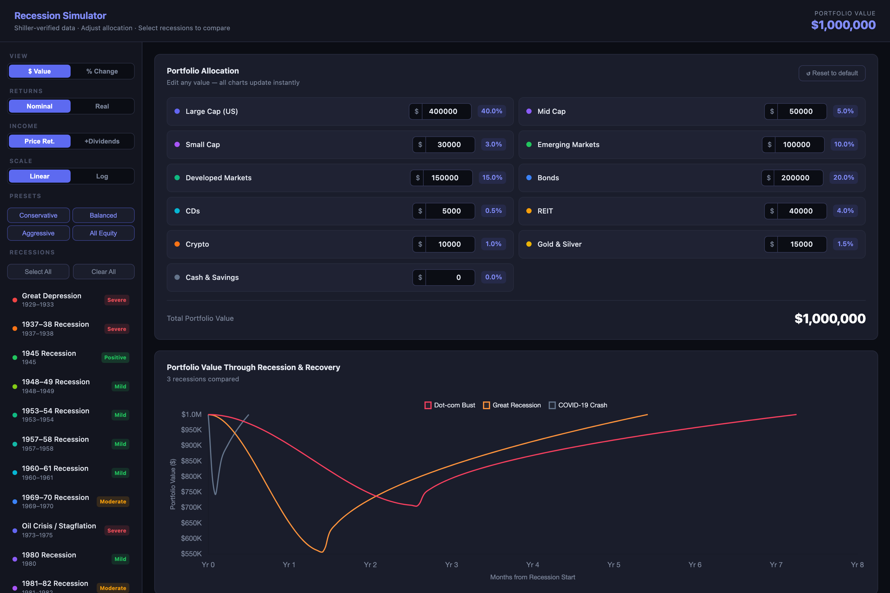

# Recession Simulator

A portfolio stress-test tool: pick a custom multi-asset allocation, then see how it would have moved through every U.S. recession since the Great Depression — peak to trough to recovery — using historically verified drawdown data rather than a single "the market fell X%" headline number.

## What it models

- **15 recessions, 1929–2020** — each with its own peak-to-trough drawdown, recovery length, and average inflation rate, cross-referenced against Bloomberg/Winthrop Wealth bear-market tables and Robert Shiller's long-run price dataset. Three data points were explicitly corrected from earlier under/overestimates, and every correction is documented with its source and reasoning.
- **11-asset allocation model** — equities (large/mid/small cap, EM, developed markets), fixed income (bonds, CDs), and real assets (REIT, gold & silver, crypto, cash). Portfolio drawdown is the allocation-weighted average of each asset class's era-specific return; dollar impact is broken out per asset so "worst asset: REIT –$68,000" is answerable, not just "portfolio down 22%."
- **Recovery curve shape, not a straight line** — the decline phase uses a smoothstep (cubic Hermite) ease-in/ease-out curve, and the recovery phase uses a square-root curve (fast initial rebound, decelerating tail) — a closer approximation to how real drawdowns and recoveries actually move than linear interpolation between two points.
- **Real vs. nominal returns** — toggle inflation-adjusted values. This matters most for the 1970s/early-1980s recessions: the 1980 recession's nominal –17% becomes materially worse once ~13.5% CPI is factored in.
- **Price return vs. total return** — toggle dividend income on top of price movement, using era-specific yields per asset class (bond yields alone ranged from ~2% in the WWII era to ~13% at the 1981–82 Volcker peak). Modeled as received-not-reinvested — a simple cash accrual, not compounded growth.
- **Portfolio presets** — Conservative / Balanced / Aggressive / All-Equity mixes, each with a fully documented allocation breakdown, so the tool doubles as a quick illustration of how risk tolerance changes drawdown exposure.

## Try it

Open `index.html` directly in a browser — no build step, no server, no dependencies beyond Chart.js (CDN). Adjust the allocation panel and every chart, metric, and table updates instantly.

## Notes

- Single-file vanilla HTML/CSS/JS, styled with Chart.js for the visualizations. No framework, no bundler, no backend.
- Full methodology, data sources, per-era asset-class proxies, and structural limitations (no rebalancing, single-trough-per-recession, correlation simplification, etc.) are documented at the bottom of the page itself — not hidden in a separate doc.
- Not financial advice. This is an educational illustration; real portfolio behavior in a recession depends on taxes, fees, margin calls, and decisions made under stress, none of which are modeled here.
