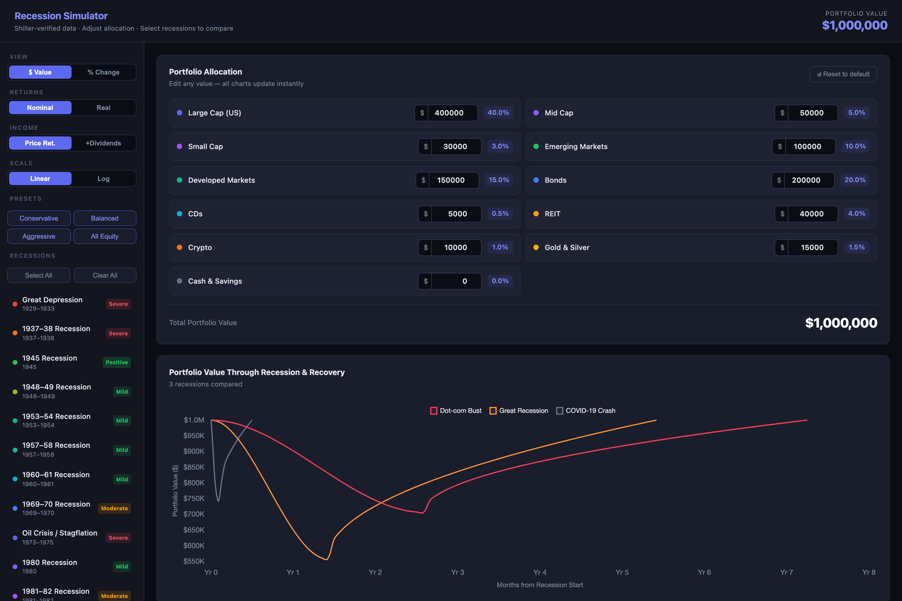

# Recession Simulator

A portfolio stress-test tool: pick a custom multi-asset allocation, then see how it would have moved through every U.S. recession since the Great Depression — peak to trough to recovery — using historically verified drawdown data rather than a single "the market fell X%" headline number.



## What it models

- **15 recessions, 1929–2020** — each with its own peak-to-trough drawdown, recovery length, and average inflation rate, cross-referenced against Bloomberg/Winthrop Wealth bear-market tables and Robert Shiller's long-run price dataset. Three data points were explicitly corrected from earlier under/overestimates, and every correction is documented with its source and reasoning.
- **11-asset allocation model** — equities (large/mid/small cap, EM, developed markets), fixed income (bonds, CDs), and real assets (REIT, gold & silver, crypto, cash). Portfolio drawdown is the allocation-weighted average of each asset class's era-specific return; dollar impact is broken out per asset so "worst asset: REIT –$68,000" is answerable, not just "portfolio down 22%."
- **Withdrawals and sequence-of-returns risk** — set a monthly draw (optionally growing with the era's CPI) and watch what selling into a drawdown does. Drawing $4,000/month through 2007–09 turns a –44.1% drawdown into –49.3%, and a 48-month recovery into one that never arrives inside the modelled window. Depletion is detected and reported.
- **Annual rebalancing** — toggle a yearly reset to target weights, renormalised over the asset classes that existed in that era.
- **S&P 500 benchmark** — overlay the same starting capital held entirely in the S&P, on the same basis: same real/nominal setting, same dividend treatment, same withdrawal, same rebalancing. Both figures are shown so the "your mix vs that" delta is checkable.
- **Shareable links** — allocation, selection and every toggle live in the URL hash, so a scenario survives a reload and can be sent to someone.
- **Recovery curve shape, not a straight line** — the decline phase uses a smoothstep (cubic Hermite) ease-in/ease-out curve, and the recovery phase uses a square-root curve (fast initial rebound, decelerating tail) — a closer approximation to how real drawdowns and recoveries actually move than linear interpolation between two points.
- **Real vs. nominal returns** — toggle inflation-adjusted values. This matters most for the 1970s/early-1980s recessions: the 1980 recession's nominal –17% becomes materially worse once ~13.5% CPI is factored in.
- **Price return vs. total return** — toggle dividend income on top of price movement, using era-specific yields per asset class (bond yields alone ranged from ~2% in the WWII era to ~13% at the 1981–82 Volcker peak). Modeled as received-not-reinvested — a simple cash accrual, not compounded growth.
- **Portfolio presets** — Conservative / Balanced / Aggressive / All-Equity mixes, each with a fully documented allocation breakdown, so the tool doubles as a quick illustration of how risk tolerance changes drawdown exposure.

## Try it

Open `index.html` directly in a browser — no build step, no server, no dependencies beyond Chart.js (CDN, pinned with an SRI hash and a graceful fallback if it is blocked). Adjust the allocation panel and every chart, metric, and table updates instantly.

The whole page is keyboard navigable: the recession list is a set of real checkbox buttons, every allocation input is labelled, and the charts carry accessible names pointing at the comparison table that holds the same figures as text.

## Verifying changes

```sh
osascript -l JavaScript verify.js
```

685 assertions covering the simulation invariants, the recession dataset, the
documented proxy rules, shareable-link round-tripping and the feature behaviour.
It evaluates the real script block out of `index.html` under stub DOM objects, so
the tests exercise the shipped code and cannot drift from it. There is no Node on
the machine this was built on, hence `osascript`.

The invariant that matters most: **the per-asset dollar figures must sum to the
headline figure**, in all four real × dividend combinations. That silently broke
once — the "crypto didn't exist before 2009" carve-out was added to one of the two
functions that needed it — and the disagreement reached $2,482 before anyone
noticed. It is now structural (one simulation feeds both) and asserted.

## Notes

- Single-file vanilla HTML/CSS/JS, styled with Chart.js for the visualizations. No framework, no bundler, no backend.
- Dividends accrue monthly on the *current* balance and are held as cash, not reinvested — a position down 80% pays income on the reduced balance. The yield itself is held constant, so income is understated in severe crashes (real yields rose as prices collapsed); read it as a conservative floor.
- Real-mode recovery lengths depend on two stated assumptions: 7% nominal growth once a recession's recovery window closes, and long-run inflation normalising to 3%. Both are documented in the methodology panel.
- Full methodology, data sources, per-era asset-class proxies, and structural limitations (no rebalancing, single-trough-per-recession, correlation simplification, etc.) are documented at the bottom of the page itself — not hidden in a separate doc.
- Not financial advice. This is an educational illustration; real portfolio behavior in a recession depends on taxes, fees, margin calls, and decisions made under stress, none of which are modeled here.
